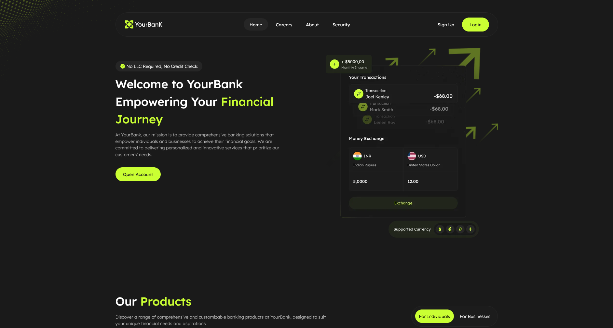

# YourBank — современный лендинг для банка


---

## 📸 Скриншоты

<div align="center">
  
  <p><em>Главная страница лендинга</em></p>
</div>

👉 [Открыть сайт](https://zheny179.github.io/your-bank/)

---

## 💡 О проекте

**YourBank** — это современный адаптивный лендинг для вымышленного банка,
демонстрирующий навыки верстки многостраничных сайтов (MPA) с интерактивными
компонентами.
Проект реализован на Astro.js с использованием компонентного подхода и
современных
CSS-техник.

Сайт включает главную страницу с hero-секцией, слайдерами отзывов, табовой
навигацией
и плавными переходами между страницами благодаря View Transitions API.

---

## 🎯 Цели проекта

Этот проект был создан с конкретными учебными целями:

### 1. Закрепление навыков Astro.js

- Работа с компонентным подходом в Astro (разделение на `components/` и
  `sections/`)
- Использование View Transitions API для плавных переходов между страницами
- Интеграция клиентских библиотек (Swiper.js) с серверным рендерингом
- Оптимизация производительности через статическую генерацию

### 2. Знакомство с pnpm

- Переход с npm на pnpm для более быстрой и эффективной работы с зависимостями
- Использование `pnpm-lock.yaml` вместо `package-lock.json`
- Понимание преимуществ pnpm: экономия места на диске, строгая изоляция пакетов

### 3. Изучение доступности (A11y)

- Семантическая HTML-разметка (`<main>`, `<nav>`, `<header>`, `<footer>`)
- ARIA-атрибуты для интерактивных элементов (табы, слайдеры)
- Поддержка навигации с клавиатуры
- Использование `:focus-visible` для видимости фокуса
- Учет `prefers-reduced-motion` для пользователей с вестибулярными
  расстройствами
- Правильная структура заголовков (h1-h6)

### 4. Изучение SEO

- Open Graph мета-теги для красивого отображения в соцсетях
- Семантические мета-теги (`description`, `title`)
- Оптимизация структуры URL через `BASE_URL`
- Правильное использование favicon и apple-touch-icon

## ✨ Особенности реализации

### Доступность (A11y)

- 🎯 **Семантическая разметка** — использование `<main>`, `<nav>`, `<header>`,
  `<footer>` для правильной структуры документа
- ♿ **ARIA-атрибуты** — `role="tabpanel"`, `aria-labelledby` для табов, чтобы
  скринридеры правильно озвучивали интерфейс
- ⌨️ **Навигация с клавиатуры** — все интерактивные элементы доступны через Tab,
  Enter, Space
- 👁️ **Focus-visible** — стилизация фокуса только при навигации с клавиатуры (не
  при клике мышью)
- 🎭 **Prefers-reduced-motion** — отключение анимаций для пользователей, которые
  указали это в настройках системы

### SEO

- 🔗 **Open Graph** — мета-теги `og:title`, `og:description`, `og:image` для
  красивых превью в соцсетях
- 📝 **Мета-описания** — уникальные `title` и `description` для каждой страницы
- 🌐 **Базовый URL** — использование `BASE_URL` для корректной работы при деплое
  в поддиректорию
- 🖼️ **Favicon** — полный набор иконок для разных устройств (16x16, 32x32,
  192x192, 512x512, apple-touch-icon)

## ✨ Особенности

🎨 **Адаптивная верстка** — корректное отображение на всех устройствах  
🌊 **Fluid-типографика** — плавное изменение размеров шрифтов без
медиа-запросов  
🔄 **View Transitions** — плавные переходы между страницами  
📱 **Мобильное меню** — оверлейное меню с анимацией открытия/закрытия  
🎠 **Интерактивные слайдеры** — на базе Swiper.js с поддержкой скрытых вкладок  
♿ **Доступность (a11y)** — семантические теги, ARIA-атрибуты, поддержка
клавиатуры  
⚡ **Оптимизация** — минимальный JavaScript, ленивая загрузка  
🔗 **Open Graph** — красивое отображение ссылок в соцсетях


## 🛠️ Используемые инструменты и технологии

### Основные технологии:

- **HTML5** — семантическая разметка страниц учебника
- **SCSS (Sass)** — препроцессор CSS с миксинами, переменными и
  fluid-типографикой
- **JavaScript (Vanilla)** — интерактивность без фреймворков
- **Astro.js** — статический генератор сайтов (Zero JS по умолчанию).

### Библиотеки и утилиты:

- **Swiper.js** — современная библиотека для создания слайдеров.
- **modern-normalize** — альтернатива CSS reset для кроссбраузерной
  консистентности.


### Сборка и окружение:

- **Vite** — молниеносный сборщик (используется под капотом Astro).
- **pnpm** – быстрый и эффективный менеджер пакетов

### Разработка и дизайн:

- **WebStorm** — IDE для написания кода
- **Figma** — дизайн интерфейса

### Методология и качество:

- **БЭМ методология** — структурированное именование CSS-классов
- **W3C Validator** — проверка HTML-разметки на соответствие стандартам
- **CSS-переменные** — централизованное управление цветовой схемой и отступами
- **ResizeObserver** — инициализация слайдеров в скрытых вкладках

---

## 🚀 Как запустить локально

### Требования

- Node.js версии 18 или выше ([скачать](https://nodejs.org/))
- Git ([скачать](https://git-scm.com/))
- pnpm ([установить](https://pnpm.io/installation))

### Шаги установки

1. Склонируй репозиторий:
   ```bash
   git clone https://github.com/Zheny179/your-bank.git
   ```
2. Перейди в папку проекта
   ```bash
   cd your-bank
   ```
3. Установи зависимости
   ```bash
   pnpm install
   ```
4. Запусти проект в режиме разработки:
   ```bash
   pnpm dev
   ```
5. Для сборки проекта:
   ```bash
   pnpm build
   ```
6. Для просмотра собранного проекта локально:
   ```bash
   pnpm preview
   ```

---

## 🎨 Структура проекта

```text
your-bank/
├── public/                     # Статические файлы
├── src/
│   ├── assets/                 # Медиафайлы
│   │   ├── fonts/              # Шрифты
│   │   ├── icons/              # SVG-иконки
│   │   └── images/             # Растровые изображения
│   ├── components/             # Атомарные UI-компоненты
│   ├── layouts/                # Базовые шаблоны страниц
│   ├── pages/                  # Роутинг Astro
│   ├── sections/               # Крупные смысловые блоки страниц
│   └── styles/                 # Глобальные стили и архитектура SCSS
│       ├── helpers/            # Миксины, функции, медиа-запросы и константы
│       ├── globals.scss        # Глобальный сброс и базовые стили
│       └── var.scss            # CSS-переменные (цвета, тени, тайминги)
├── astro.config.mjs            # Конфигурация Astro
├── package.json                # Зависимости проекта
├── pnpm-lock.yaml              # Фиксация версий pnpm
└── README.md                   # Документация проекта
```

## 🤔 Почему Astro и pnpm?

Astro был выбран по нескольким причинам:

- View Transitions — встроенная поддержка плавных переходов между страницами без
  написания сложного JS.
- Zero JS по умолчанию — минимальный JavaScript = быстрая загрузка и высокий
  балл в Lighthouse.
- Гибкость — возможность использовать SCSS и Vanilla JS там, где это нужно, без
  оверхеда React/Vue.

pnpm используется в качестве менеджера пакетов, так как он:

- Экономит место на диске за счет жестких ссылок (hard links).
- Работает значительно быстрее стандартного `npm`.
- Обеспечивает более строгую и безопасную установку зависимостей.


## 🔧 Интересные технические решения

### Инициализация слайдеров в скрытых вкладках

Для корректной работы Swiper.js внутри табов (которые скрыты через display: none
при загрузке) используется `ResizeObserver`. Это позволяет инициализировать
слайдер и рассчитать его размеры ровно в тот момент, когда вкладка становится
видимой, избегая багов с "схлопыванием" слайдера.

### Fluid-типографика

```scss
@use 'sass:math';
@use 'constants' as *;

/// Генерирует fluid-значение через clamp()
///
/// @param {Number} $max - Максимальное значение в пикселях
/// @param {Number} $min - Минимальное значение в пикселях
/// @param {Number} $max-vw - Ширина вьюпорта для $max (десктоп)
/// @param {Number} $min-vw - Ширина вьюпорта для $min (мобильный)
/// @return {String} - CSS-выражение clamp()
@function fluid(
  $max: 100,
  $min: 10,
  $max-vw: $container-desktop-width,
  $min-vw: 390
) {
  @if $max <= $min {
    @error 'fluid(): $max (#{$max}px) должен быть больше $min (#{$min}px).';
  }
  
  @if $max-vw <= $min-vw {
    @error 'fluid(): $max-vw (#{$max-vw}px) должен быть больше $min-vw (#{$min-vw}px).';
  }
  
  // Переводим пиксели в rem, деля на базовый размер шрифта
  $max-size: math.div($max, $base-font-size);
  $min-size: math.div($min, $base-font-size);
  $max-width: math.div($max-vw, $base-font-size);
  $min-width: math.div($min-vw, $base-font-size);
  
  // Линейная интерполяция: y = slope * x + y-intersection
  $slope: math.div(($max-size - $min-size), ($max-width - $min-width));
  $y-axis-intersection: -$min-width * $slope + $min-size;
  
  @return clamp(
    #{$min-size}rem,
    calc(#{$y-axis-intersection}rem + #{$slope * 100}vw),
    #{$max-size}rem
  );
}
```

Идея Fluid-подхода простая: размер должен плавно масштабироваться вместе с
шириной окна браузера. На маленьком экране он минимальный, на большом —
максимальный, а между ними он линейно растёт.

```scss
h1 {
  font-size: fluid(32, 18);
}
```

---

## 📜Ссылочки

- [Astro](https://astro.build/)
- [Swiper.js](https://swiperjs.com/)
- [pnpm](https://pnpm.io0/)
- [modern-normalize](https://github.com/sindresorhus/modern-normalize)

---

## 📄 Лицензия

Этот проект распространяется под лицензией MIT. Подробности в
файле [LICENSE](./LICENSE).
